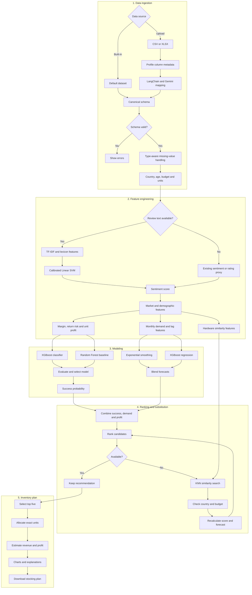

# Mobile Inventory Restocking Tool V2

A production-oriented machine learning application for demand forecasting, market scoring, sentiment-ready data ingestion and inventory allocation.

## What changed in V2

V2 replaces the notebook-only workflow with reusable Python modules and a Streamlit application. It keeps exponential smoothing, country and age analysis, profit-aware ranking, unavailable-product filtering and exact stock allocation.

The advanced stack includes:

- XGBoost classification for product-success scoring
- Random Forest as a comparison model
- XGBoost regression with lag features for demand forecasting
- Damped exponential smoothing retained as a statistical forecast
- A blended statistical and machine learning forecast
- TF-IDF and lexicon features with a calibrated linear SVM for sentiment analysis
- LangChain with Google Gemini for uploaded-dataset schema mapping
- Type-aware missing-value handling for user-uploaded datasets
- Deterministic schema validation and type conversion
- Exact largest-remainder stock allocation
- Streamlit interface and downloadable recommendations

## V2 workflow



## Architecture

```text
app.py
src/
  allocation.py
  forecasting.py
  pipeline.py
  schema.py
  sentiment.py
notebooks/
  eda_v2.ipynb
tests/
  test_core.py
Mobile Reviews Sentiment.csv
```

## Data modes

- Full mode: product, price, date, demand or review records, and sentiment information
- Forecast mode: product, price, date, and demand or review records
- Review mode: product, price, and review text or sentiment
- Recommendation mode: product and price

Product and price are required. Optional ratings, age, brand and country are handled according to their data type when values are absent.

## Missing values in uploaded datasets

Uploaded datasets can have incomplete columns without forcing the pipeline to treat every missing value the same way. The ingestion layer first converts mapped features to their canonical types, protects required business fields, and then applies feature-specific handling inside the machine-learning pipeline. Imputers are fitted as part of the scikit-learn preprocessing pipeline, which prevents validation data from leaking into training transformations.

| Data type | Examples | Recommended handling |
| --- | --- | --- |
| Required identifiers | `model` | Reject rows or datasets with missing or blank identifiers |
| Required price | `price_inr`, `price_usd` | Recover INR from USD when possible; otherwise reject invalid values |
| Correlated numeric features | Product rating fields | MICE with `IterativeImputer` inside the model pipeline |
| Other numeric predictors | `age`, `purchase_cost` | Country- or brand-level median followed by a safe global median |
| Categorical features | `brand`, `country` | Fill with `"Unknown"` or `"Global"`, then encode unseen categories safely |
| Review text | `review_text` | Replace missing text with an empty string before text processing |
| Regression target | `units_sold` | Never impute training targets; train only on rows with observed values |
| Missing time periods | Monthly demand | Reindex the monthly series; use zero for absent review activity and short interpolation for sales gaps |
| Dates | `review_date` | Reject missing or invalid values when forecasting data is supplied |

MICE is reserved for correlated rating variables, where the remaining ratings can help estimate a missing value. Ordinary numeric predictors use simpler median strategies, while categorical values are not passed to KNN imputation because numeric distances between encoded categories would not represent real similarity. XGBoost and Random Forest therefore receive the same leakage-safe, reproducible preprocessing.

## LangChain and Gemini schema mapping

The optional mapper uses LangChain's `ChatGoogleGenerativeAI` integration and the `gemini-flash-latest` model alias. It sends only column names, inferred types and nullability. Dataset rows are not sent. Gemini returns a structured mapping through a Pydantic schema, and Python validates it before applying approved renaming and type conversions. Generated code is not executed.

Create a Gemini API key in Google AI Studio and set it before starting the app:

```bash
export GOOGLE_API_KEY="your-key"
```

Gemini API free-tier availability and rate limits depend on Google's current terms and the selected region. Manual and deterministic mapping remain available without an API key.

## Canonical fields

Required:

- `model`
- `price_inr` or `price_usd`

Optional:

- `review_id`
- `brand`
- `country`
- `age`
- `review_date`
- `review_text`
- `sentiment`
- `rating`
- `battery_life_rating`
- `camera_rating`
- `performance_rating`
- `design_rating`
- `display_rating`
- `units_sold`
- `purchase_cost`

Alternate names such as `product`, `mobile_name`, `nation`, `sales` and `cost` can be mapped to this schema.

## Modeling approach

### Product-success model

Country and product records are aggregated into a market table. A proxy winner label is created from country-level sentiment and demand thresholds. XGBoost is the default classifier, with Random Forest available for comparison. Correlated rating features are imputed with MICE, other numeric values use median strategies, and categorical values use explicit unknown categories.

The built-in dataset contains review activity rather than verified transactions, so the target is a proxy. Production deployments should use an observed outcome such as target attainment, stock-out risk or profitable restocking.

### Demand forecast

Monthly demand uses `units_sold` when available. Missing regression targets are not imputed for training. Otherwise, monthly review volume is used as a demand proxy. The forecast combines damped exponential smoothing with XGBoost regression using three lags and a rolling mean. Monthly series are reindexed so absent review activity can be represented as zero, while short internal sales gaps can be interpolated. Short histories fall back to exponential smoothing or the historical mean.

### Sentiment

The sentiment module combines word and bigram TF-IDF features with lexicon features for positive terms, negative terms, negations and intensifiers. A calibrated linear SVM produces class probabilities. Missing optional review text becomes an empty string. A labeled `review_text` dataset is required to train the classifier; the built-in dataset can continue using its existing sentiment column when text is unavailable.

### Inventory allocation

The final rank uses the harmonic mean of success probability and normalized estimated profit. Largest-remainder allocation guarantees that suggested quantities sum exactly to the requested units.

## Installation

```bash
python -m venv .venv
source .venv/bin/activate
pip install -r requirements.txt
```

On Windows:

```bash
.venv\Scripts\activate
pip install -r requirements.txt
```

## Run

```bash
streamlit run app.py
```

Choose the built-in dataset or upload a CSV/XLSX file, confirm the schema mapping, select the target market and generate a stocking plan.

## Tests

```bash
pytest -q
```

The tests cover exact allocation, deterministic schema mapping, required-field validation, invalid types, currency recovery, blank identifiers and invalid forecast dates.

## Current assumptions

- Built-in review counts are demand proxies, not confirmed sales.
- USD prices use a fixed conversion rate of 87 INR per USD.
- Margins and return rates are heuristic until transaction-level data is provided.
- The winner label is based on relative sentiment and demand within each country.
- Gemini mapping is advisory and always followed by deterministic validation.
- Short sales gaps are interpolated only when they occur inside an observed monthly series.

## Recommended production data

- Historical units sold
- Current inventory
- Purchase cost and selling price
- Supplier lead time
- Minimum order quantity
- Maximum supplier capacity
- Returns and lost sales
- Storage cost and procurement budget

These fields can support constrained profit optimization and stock-out risk prediction in a later release.
