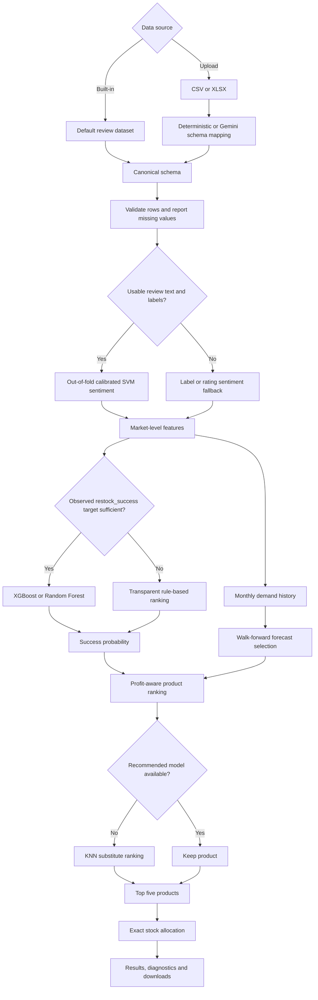

# Mobile Inventory Restocking Tool V2

An end-to-end machine learning application that recommends which mobile products to restock and how many units to allocate. It combines product reviews, ratings, demand history, pricing and purchase costs to generate an explainable stocking plan through a Streamlit interface.

## Project overview

Inventory planning involves more than selecting the highest-rated products. A practical system must understand customer sentiment, estimate demand, account for profitability, handle unavailable products and work with incomplete business data.

This project builds a complete inventory recommendation pipeline that:

1. Accepts the bundled dataset or an uploaded CSV/XLSX file.
2. Converts different source-column names into a standard schema.
3. Validates records and separates invalid rows.
4. Extracts sentiment and product-level features.
5. Ranks products using supervised ML when historical success labels are available.
6. Uses a transparent scoring method when labels are unavailable.
7. Compares demand-forecasting methods using walk-forward validation.
8. Recommends substitutes for unavailable products.
9. Allocates the requested stock across the final recommendations.
10. Displays diagnostics and exports the stocking plan.

## Highlights

- Streamlit application for built-in and uploaded CSV/XLSX datasets
- Deterministic schema aliases with optional LangChain and Gemini assistance
- Row-level validation, missing-value reports and downloadable rejected rows
- MICE for correlated rating aggregates and median handling for other numeric predictors
- Transparent rule-based ranking when an external target is unavailable
- Optional XGBoost or Random Forest success modeling with an observed `restock_success` target
- Cross-validated comparison of MICE and native XGBoost missing-value handling
- Out-of-fold TF-IDF, lexicon and calibrated Linear SVM sentiment scores
- Walk-forward comparison of naive, exponential-smoothing, XGBoost and blended forecasts
- Purchase-cost-based profit estimates with documented fallbacks
- KNN substitute ranking using similarity, success probability and profit
- Exact largest-remainder unit allocation

## Workflow



## Architecture

```text
ML_restocking_tool/
├── app.py
├── src/
│   ├── allocation.py
│   ├── forecasting.py
│   ├── missing_values.py
│   ├── model_selection.py
│   ├── pipeline.py
│   ├── schema.py
│   ├── sentiment.py
│   └── substitution.py
├── notebooks/
│   ├── EDA_V2.ipynb
│   └── eda_outputs/
├── tests/
│   └── test_core.py
├── .github/
│   └── workflows/
│       └── ci.yml
├── Mobile Reviews Sentiment.csv
├── requirements.txt
├── requirements-dev.txt
└── pyproject.toml
```

### Main components

| Component | Purpose |
| --- | --- |
| `app.py` | Streamlit interface, file upload, user inputs and result display |
| `schema.py` | Column mapping, validation, type conversion and rejected-row handling |
| `missing_values.py` | Missing-value reports and handling descriptions |
| `sentiment.py` | TF-IDF, lexicon features and calibrated Linear SVM sentiment scoring |
| `model_selection.py` | Preprocessing, MICE comparison, XGBoost and Random Forest training |
| `forecasting.py` | Monthly history creation and walk-forward forecast selection |
| `substitution.py` | KNN-based alternatives for unavailable products |
| `allocation.py` | Exact integer allocation using the largest-remainder method |
| `pipeline.py` | End-to-end orchestration of ranking, forecasting and allocation |

## Data modes

The application adapts its behavior to the information available in the dataset:

| Mode | Available information | Behavior |
| --- | --- | --- |
| Full | Product, price, dates, demand and reviews | Ranking, sentiment and forecasting |
| Forecast | Product, price, dates and demand | Forecasting plus non-text ranking |
| Review | Product, price and review information | Sentiment-informed ranking |
| Recommendation | Product and selling price | Transparent rule-based ranking |
| Supervised | Any mode plus sufficient `restock_success` labels | XGBoost or Random Forest success probabilities |

The bundled review dataset does not contain an externally observed product-success target. It therefore uses transparent ranking instead of training a classifier to reproduce a proxy label.

## Dataset requirements

### Required fields

- `model`
- `price_inr` or `price_usd`

### Optional fields

- `review_id`
- `brand`
- `country`
- `age`
- `review_date`
- `review_text`
- `sentiment`
- `rating`
- `battery_life_rating`
- `camera_rating`
- `performance_rating`
- `design_rating`
- `display_rating`
- `units_sold`
- `purchase_cost`
- `restock_success`

`restock_success` must be an externally observed binary outcome, such as whether a previous restocking decision achieved its defined business target. It is never generated from the same model inputs.

The generic column name `cost` is intentionally not mapped automatically because it could mean either selling price or purchase cost. Explicit names such as `selling_price`, `retail_price`, `procurement_cost` or `wholesale_cost` are preferred.

## Schema adaptation and validation

Uploaded datasets often use different column names for the same business feature. The schema adapter first applies deterministic aliases and can optionally request Gemini suggestions for unmapped columns. The user can review and edit every mapping before processing.

Only column names, inferred types and nullability are sent to Gemini. Dataset rows are not sent.

Rows without a valid product identifier or selling price are rejected. If forecasting fields are supplied, rows with invalid dates are also rejected. Valid records continue through the pipeline, while canonical valid rows and rejected rows can be downloaded separately.

## Missing-value handling

| Data type | Examples | Handling |
| --- | --- | --- |
| Required identifiers | `model` | Reject missing or blank values |
| Required selling price | `price_inr`, `price_usd` | Recover INR from USD when possible; otherwise reject |
| Correlated numeric features | Product ratings | MICE inside training folds |
| Other numeric predictors | `age`, `purchase_cost` | Group or global median with documented fallbacks |
| Categorical features | `brand`, `country` | Fill with `Unknown` or `Global` |
| Review text | `review_text` | Use an empty string and sentiment fallback |
| Regression target | `units_sold` | Keep missing; never impute the target |
| Success target | `restock_success` | Use only observed labels |
| Missing monthly periods | Demand history | Zero for review activity or limited internal interpolation for sales gaps |
| Forecast dates | `review_date` | Reject invalid forecasting rows |

Model imputers are fitted inside the training pipeline so validation data does not influence preprocessing.

## Sentiment analysis

When enough positive and negative labeled reviews are available, the application combines:

- TF-IDF word and bigram features
- Positive and negative lexicon features
- Negation indicators
- Intensity indicators
- A calibrated Linear SVM classifier

Out-of-fold probabilities are used for labeled training records. A final sentiment model is then fitted for new or unlabeled review text. When the available text is insufficient, the pipeline falls back to an existing sentiment label or a rating-derived score.

The application reports out-of-fold ROC-AUC and F1 when the sentiment model can be trained.

## Product ranking

### Transparent rule-based mode

When no reliable external target exists, products are ranked using:

- 45% sentiment
- 35% average product ratings
- 20% normalized demand activity

The ranking probability is combined with normalized expected unit profit using a harmonic mean. Products with non-positive expected profit are excluded.

### Supervised mode

When enough observed `restock_success` examples from both classes are available, the application trains either XGBoost or Random Forest.

For XGBoost, MICE and native missing-value handling are compared using stratified cross-validation. The selected preprocessing strategy is evaluated on a holdout set, and the target column is never included among the model features.

## Demand forecasting

Monthly demand uses observed `units_sold` when available. If sales data is absent, review activity is used as a demand proxy.

Walk-forward validation compares the methods supported by the available history:

- Naive last-value forecast
- Damped exponential smoothing
- XGBoost lag regression when sufficient history exists
- A blended XGBoost and exponential-smoothing forecast

The method with the lowest validation mean absolute error produces the final forecast. The selected method and its MAE are displayed in the stocking plan.

## Profit estimation and substitution

Observed purchase cost is preferred. Missing costs fall back through brand and global medians before a margin-based estimate is used. Net unit profit subtracts estimated return-related costs, and non-profitable products are removed from the candidate list.

If a recommended model is unavailable, KNN compares standardized selling price and hardware-rating features. Replacement candidates are ranked using:

- 60% similarity
- 25% success probability
- 15% normalized profit

The output identifies the unavailable product in `substitute_for` and reports the substitution similarity.

## Stock allocation

The top products receive inventory according to their forecast weights. The largest-remainder method converts these continuous weights into whole units while ensuring that the final allocated quantity exactly matches the number requested by the user.

## Application inputs

The Streamlit interface allows the user to select:

- Built-in or uploaded data
- Country or market
- Target customer age
- Maximum unit selling price
- Total units to allocate
- XGBoost or Random Forest for supervised ranking
- Products that are currently unavailable

## Stocking-plan output

The generated plan can include:

- Brand and model
- Substitute product details
- Selling price and estimated purchase cost
- Success probability or explainable score
- Demand forecast
- Selected forecast method and validation MAE
- Suggested quantity
- Estimated revenue
- Estimated profit

The completed stocking plan can be downloaded as a CSV file.

## Technology stack

- Python
- Pandas and NumPy
- Scikit-learn
- XGBoost
- Statsmodels
- Streamlit
- LangChain and Gemini
- Pytest
- GitHub Actions

## Installation

Python 3.11–3.13 is supported.

```bash
python -m venv .venv
source .venv/bin/activate
pip install -r requirements-dev.txt
```

On Windows:

```bash
.venv\Scripts\activate
pip install -r requirements-dev.txt
```

Run the application:

```bash
streamlit run app.py
```

## Optional Gemini mapping

Set a Google API key before enabling Gemini schema mapping:

```bash
export GOOGLE_API_KEY="your-key"
```

On Windows PowerShell:

```powershell
$env:GOOGLE_API_KEY="your-key"
```

## Testing

Run the unit tests:

```bash
pytest
```

Run Python compilation checks:

```bash
python -m compileall -q app.py src tests
```

The test suite covers schema mapping, invalid-row rejection, missing-value reporting, target leakage prevention, profit calculations, recommendation fallback behavior, short-history forecasting, exact stock allocation and KNN substitution.

## Continuous integration

The workflow in `.github/workflows/ci.yml` runs on pushes to the main development branches and on pull requests targeting `main`. It installs the development dependencies, compiles the Python source and executes the complete test suite.
