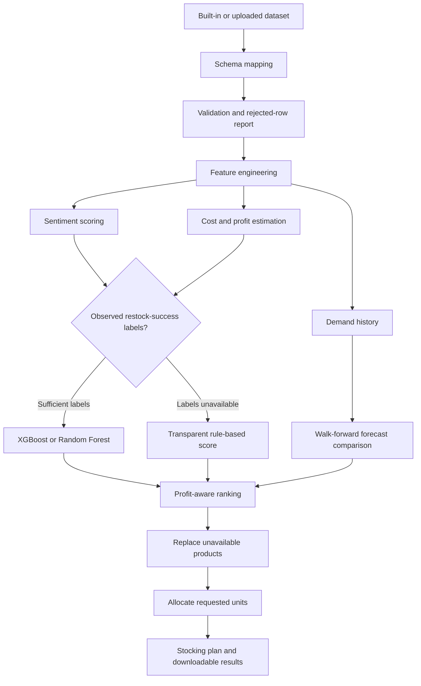

# Mobile Inventory Restocking Tool

An end-to-end machine learning application that converts product, review, pricing, and sales data into an explainable inventory restocking plan.

The project answers a practical retail question:

> Given a market, customer profile, selling-price limit, and number of units to purchase, which mobile products should be restocked and in what quantities?

The application combines data validation, sentiment analysis, product-success scoring, demand forecasting, profit estimation, substitute recommendations, and exact stock allocation in a Streamlit interface.

## Project overview

Retail inventory decisions require more than selecting highly rated products. A useful recommendation must also consider customer sentiment, local demand, expected profit, missing or inconsistent data, and product availability.

This project builds a complete decision pipeline that:

1. Accepts the bundled dataset or an uploaded CSV/XLSX file.
2. Maps different source-column names to one canonical schema.
3. validates rows and separates invalid records.
4. Creates sentiment, rating, demand, and profit features.
5. Uses supervised learning when a genuine historical outcome is available.
6. Falls back to a transparent weighted score when labels are unavailable.
7. Compares forecasting methods using walk-forward validation.
8. Finds similar substitutes for unavailable products.
9. Allocates the requested inventory units across the final products.
10. Displays diagnostics and exports the stocking plan.

## Key features

- Interactive Streamlit application
- CSV and XLSX upload support
- Deterministic schema mapping with optional Gemini assistance
- Row-level data validation and downloadable rejected rows
- Missing-value reporting and model-safe imputation
- TF-IDF and lexicon-based sentiment analysis
- XGBoost and Random Forest product-success models
- Transparent rule-based fallback for unlabeled datasets
- Walk-forward demand forecast evaluation
- Profit-aware product ranking
- K-nearest-neighbors product substitution
- Exact largest-remainder stock allocation
- Automated tests and GitHub Actions CI

## How the system works



## Machine learning design

### 1. Schema adaptation

Uploaded datasets may use names such as `product`, `mobile_name`, `selling_price`, or `sales`. The schema adapter maps these aliases to canonical fields such as `model`, `price_inr`, and `units_sold`.

Deterministic mappings are used first. Gemini mapping is optional and only receives column names, inferred data types, and nullability information. All mappings remain editable in the interface before processing.

### 2. Data validation and missing values

A product identifier and selling price are required. Rows with invalid required values are rejected without stopping valid records from continuing through the pipeline.

The application handles missing data according to feature meaning:

- Rating features: MICE imputation inside model-training folds
- Other numeric predictors: median-based imputation
- Brand and country: safe categorical defaults
- Purchase cost: brand median, global median, then margin fallback
- Review text: empty-text fallback
- Demand and success targets: never imputed

Keeping model imputation inside training folds helps prevent validation leakage.

### 3. Sentiment analysis

When sufficient positive and negative review labels are available, the project trains a calibrated Linear SVM using:

- TF-IDF word and bigram features
- Positive and negative lexicon features
- Negation and intensity indicators

Out-of-fold probabilities are generated for training records so downstream models do not receive in-sample sentiment predictions. If text or labels are insufficient, the system falls back to the supplied sentiment label or a rating-derived score.

### 4. Product-success ranking

The ranking strategy depends on the available data.

#### Supervised mode

If the dataset contains enough externally observed `restock_success` examples from both classes, the application trains either XGBoost or Random Forest.

The target is excluded from the feature set. For XGBoost, MICE and native missing-value handling are compared with stratified cross-validation before final evaluation on a holdout set.

#### Explainable fallback mode

If a trustworthy target is unavailable, the application does not create an artificial label. Instead, it calculates an explainable score using:

- 45% sentiment
- 35% average product ratings
- 20% normalized demand activity

This score is combined with normalized expected unit profit using a harmonic mean. Products with non-positive expected profit are excluded.

### 5. Demand forecasting

Monthly demand uses `units_sold` when available. Otherwise, review activity is explicitly treated as a demand proxy.

Walk-forward validation compares:

- Naive last-value forecast
- Damped exponential smoothing
- XGBoost lag regression for sufficiently long histories
- A blended XGBoost and exponential-smoothing forecast

The method with the lowest validation mean absolute error is selected for each recommended product.

### 6. Profit estimation

Observed purchase cost is preferred. When it is unavailable, the application uses brand and global cost medians before applying a documented margin assumption.

Estimated net unit profit accounts for:

- Selling price
- Purchase cost
- Estimated return rate
- Expected return-related cost

### 7. Product substitution

If a highly ranked product is unavailable, a K-nearest-neighbors model searches for a replacement using standardized price and hardware-rating features.

Replacement candidates are scored using:

- 60% product similarity
- 25% success probability or ranking score
- 15% normalized profit

The output records both the unavailable product and its selected substitute.

### 8. Inventory allocation

The final quantity is distributed across the selected products using the largest-remainder method. This converts continuous forecast weights into integer quantities while ensuring that the allocated quantities exactly equal the number of units requested by the user.

## Application inputs and outputs

### User inputs

- Data source: bundled dataset or CSV/XLSX upload
- Country or market
- Target customer age
- Maximum unit selling price
- Total number of units to allocate
- Preferred supervised model
- Products currently unavailable

### Stocking-plan output

The generated plan can include:

- Brand and model
- Original unavailable product, when substituted
- Substitution similarity
- Selling price and estimated purchase cost
- Success probability or explainable ranking score
- Demand forecast and selected forecasting method
- Validation MAE
- Suggested quantity
- Estimated revenue and profit

The final table can be downloaded as a CSV file.

## Supported data modes

| Mode | Available data | System behavior |
| --- | --- | --- |
| Recommendation | Product and selling price | Explainable product ranking |
| Review | Product, price, and review information | Sentiment-informed ranking |
| Forecast | Product, price, dates, and demand | Demand forecasting and non-text ranking |
| Full | Product, price, dates, demand, and reviews | Ranking, sentiment, and forecasting |
| Supervised | Any mode plus valid `restock_success` labels | XGBoost or Random Forest success scoring |

## Dataset fields

### Required

- `model`
- `price_inr` or `price_usd`

### Optional

- `review_id`
- `brand`
- `country`
- `age`
- `review_date`
- `review_text`
- `sentiment`
- `rating`
- `battery_life_rating`
- `camera_rating`
- `performance_rating`
- `design_rating`
- `display_rating`
- `units_sold`
- `purchase_cost`
- `restock_success`

`restock_success` should represent a real historical business outcome—for example, whether a previous restocking decision met its sales or availability target. It is never generated from the model's own input features.

The generic column name `cost` is intentionally not mapped automatically because it could mean either selling price or purchase cost. Explicit names such as `selling_price`, `retail_price`, `procurement_cost`, or `wholesale_cost` are preferred.

## Project structure

```text
ML_restocking_tool/
├── app.py                         # Streamlit user interface
├── src/
│   ├── allocation.py              # Integer stock allocation
│   ├── forecasting.py             # Forecast selection and diagnostics
│   ├── missing_values.py          # Missing-value reporting
│   ├── model_selection.py         # ML preprocessing and classifiers
│   ├── pipeline.py                # End-to-end orchestration
│   ├── schema.py                  # Mapping and row validation
│   ├── sentiment.py               # Sentiment feature pipeline
│   └── substitution.py            # KNN substitute selection
├── notebooks/
│   ├── EDA_V2.ipynb               # Exploratory data analysis
│   └── eda_outputs/                # Generated EDA outputs
├── tests/
│   └── test_core.py                # Core unit tests
├── .github/workflows/ci.yml       # Automated compilation and testing
├── Mobile Reviews Sentiment.csv   # Bundled demonstration dataset
├── requirements.txt
├── requirements-dev.txt
└── pyproject.toml
```

## Technology stack

- Python
- Pandas and NumPy
- Scikit-learn
- XGBoost
- Statsmodels
- Streamlit
- LangChain and Gemini for optional schema assistance
- Pytest
- GitHub Actions

## Installation

Python 3.11–3.13 is supported.

```bash
python -m venv .venv
source .venv/bin/activate
pip install -r requirements-dev.txt
```

On Windows:

```bash
.venv\Scripts\activate
pip install -r requirements-dev.txt
```

Run the application:

```bash
streamlit run app.py
```

Run the tests and syntax checks:

```bash
pytest
python -m compileall -q app.py src tests
```

To enable optional Gemini schema mapping:

```bash
export GOOGLE_API_KEY="your-key"
```

## Testing and continuous integration

The test suite covers core behaviors including:

- Exact unit allocation
- Schema mapping and validation
- Rejection of invalid rows
- INR price recovery from USD
- Missing-value strategy reporting
- Sentiment fallback behavior
- Purchase-cost and profit calculations
- Prevention of target leakage
- Rule-based recommendation mode
- Short-history forecasting
- KNN substitution

GitHub Actions automatically installs dependencies, compiles the Python source, and runs the test suite on pushes and pull requests.

## Design decisions worth discussing in an interview

### Why not generate a synthetic success target?

Training a classifier on a label created from the same input features would produce misleadingly strong metrics. The project therefore uses supervised learning only when a genuine outcome is supplied and otherwise switches to a clearly documented scoring formula.

### How is leakage reduced?

- Missing-value transformers are fitted inside model pipelines.
- Sentiment probabilities for labeled training rows are produced out of fold.
- `restock_success` is excluded from model features.
- Forecasting methods are compared with walk-forward validation rather than random time-series splits.

### Why compare multiple forecasting methods?

Inventory datasets can contain short, noisy, or irregular histories. A complex model is not automatically better, so the project compares simple and advanced methods and selects the one with the lowest validation error.

### Why include a fallback model?

Real uploaded datasets often lack historical outcome labels. The explainable fallback allows the application to remain useful while making it clear that the output is a business ranking rather than a learned probability.

### Why use KNN for substitution?

KNN provides a simple and explainable way to identify products with similar prices and hardware ratings. Business factors such as profitability and success score are then included when choosing among similar alternatives.

## Current limitations and future improvements

- The bundled dataset demonstrates the workflow and is not verified transaction history.
- Review activity is only a proxy for demand when sales data is absent.
- Return costs and fallback margins are heuristic estimates.
- The current allocator does not yet optimize for procurement budget, safety stock, lead time, minimum order quantity, or supplier capacity.
- The fixed USD-to-INR conversion should be replaced with a configurable or dated exchange rate.
- Supervised evaluation requires a larger history of real restocking outcomes for reliable business use.
- Model persistence, production monitoring, and a deployed demonstration are not included yet.

## Interview summary

A concise way to explain the project:

> I built an end-to-end inventory decision system rather than only training one model. It validates differently structured datasets, prevents common leakage issues, estimates sentiment and demand, selects between supervised and explainable ranking, accounts for profitability, recommends substitutes, and converts forecasts into an exact restocking plan through a Streamlit application.
