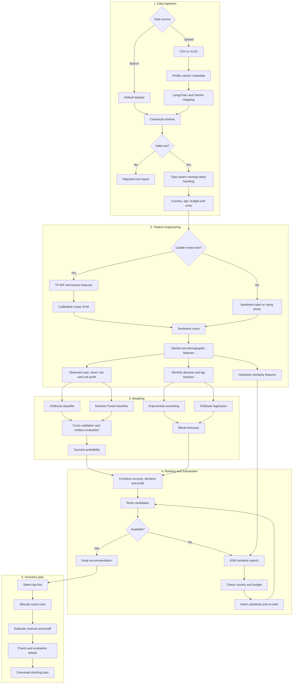

# Mobile Inventory Restocking Tool V2

A production-oriented machine learning application for demand forecasting, market scoring, sentiment analysis, schema-adaptive data ingestion and inventory allocation.

## What changed in V2

V2 replaces the notebook-only workflow with reusable Python modules and a Streamlit application. It keeps exponential smoothing, country and age analysis, and exact stock allocation while adding advanced models, user-dataset ingestion, missing-value controls and KNN-based product substitution.

The advanced stack includes:

- XGBoost classification for product-success scoring
- Random Forest as a comparison model
- Cross-validated comparison of MICE and native XGBoost missing-value handling
- XGBoost regression with lag features for demand forecasting
- Damped exponential smoothing retained in a blended forecast
- TF-IDF and lexicon features with a calibrated linear SVM for sentiment analysis
- LangChain with Google Gemini for uploaded-dataset schema mapping
- Type-aware missing-value handling and downloadable rejected-row reports
- Profit calculations based on observed purchase cost when available
- KNN-based substitutes for unavailable recommended products
- Exact largest-remainder stock allocation
- Streamlit interface and downloadable recommendations

## V2 workflow



## Architecture

```text
app.py
src/
  allocation.py
  forecasting.py
  missing_values.py
  model_selection.py
  pipeline.py
  schema.py
  sentiment.py
  substitution.py
notebooks/
  eda_v2.ipynb
tests/
  test_core.py
Mobile Reviews Sentiment.csv
```

## Data modes

- Full mode: product, price, date, demand or review records, and sentiment information
- Forecast mode: product, price, date, and demand or review records
- Review mode: product, price, and review text or sentiment
- Recommendation mode: product and price

Product and price are required. Optional ratings, age, brand and country are handled according to their data type when values are absent.

## Missing values in uploaded datasets

Uploaded datasets can contain incomplete records without forcing the pipeline to treat every missing value the same way. The ingestion layer converts mapped fields to canonical types, recovers prices when possible, separates unusable rows, and displays a missing-value report before training. Valid rows continue through the pipeline, while rejected rows can be downloaded for correction.

Model imputers are fitted inside scikit-learn pipelines. This prevents validation information from leaking into training transformations. XGBoost with MICE is compared against XGBoost's native missing-value handling through stratified cross-validation, and the winning strategy is checked on a holdout set before the final model is trained.

| Data type | Examples | Handling |
| --- | --- | --- |
| Required identifiers | `model` | Reject rows with missing or blank identifiers |
| Required price | `price_inr`, `price_usd` | Recover INR from USD when possible; otherwise reject the row |
| Correlated numeric features | Product rating fields | MICE with `IterativeImputer` inside the training pipeline |
| Other numeric predictors | `age`, `purchase_cost` | Country- or brand-level median followed by a safe global fallback |
| Categorical features | `brand`, `country` | Fill with `"Unknown"` or `"Global"` and safely encode unseen categories |
| Review text | `review_text` | Replace missing text with an empty string and use a sentiment fallback when needed |
| Regression target | `units_sold` | Never impute training targets; train only with observed values |
| Missing time periods | Monthly demand | Reindex the series; use zero for absent review activity and short interpolation for internal sales gaps |
| Dates | `review_date` | Reject invalid forecasting rows and report the reason |

MICE is reserved for correlated rating variables. Ordinary numeric predictors use simpler median strategies. Categorical fields are not passed to KNN imputation because numeric distances between encoded categories would not represent meaningful similarity. KNN is instead used where distance is meaningful: finding a similar available product by price and hardware ratings.

## LangChain and Gemini schema mapping

The optional mapper uses LangChain's `ChatGoogleGenerativeAI` integration and the `gemini-flash-latest` model alias. It sends only column names, inferred types and nullability. Dataset rows are not sent. Gemini returns a structured mapping through a Pydantic schema, and Python validates it before applying approved renaming and type conversions. Generated code is not executed.

Create a Gemini API key in Google AI Studio and set it before starting the app:

```bash
export GOOGLE_API_KEY="your-key"
```

Gemini API free-tier availability and rate limits depend on Google's current terms and selected region. Manual and deterministic mapping remain available without an API key.

## Canonical fields

Required:

- `model`
- `price_inr` or `price_usd`

Optional:

- `review_id`
- `brand`
- `country`
- `age`
- `review_date`
- `review_text`
- `sentiment`
- `rating`
- `battery_life_rating`
- `camera_rating`
- `performance_rating`
- `design_rating`
- `display_rating`
- `units_sold`
- `purchase_cost`

Alternate names such as `product`, `mobile_name`, `nation`, `sales` and `cost` can be mapped to this schema.

## Modeling approach

### Product-success model

Country and product records are aggregated into a market table. A proxy winner label is created from country-level sentiment and demand thresholds. XGBoost is the default classifier, with Random Forest available for comparison. Correlated rating features use MICE, other numeric values use median strategies and categorical values use explicit unknown categories.

For XGBoost, MICE and native missing-value handling are compared using stratified cross-validation. The selected strategy is evaluated on a holdout set, and both results are displayed in the application.

The built-in dataset contains review activity rather than verified transactions, so the target is a proxy. Production deployments should use an observed outcome such as target attainment, stock-out risk or profitable restocking.

### Demand forecast

Monthly demand uses `units_sold` when available, and missing regression targets are excluded rather than imputed. Otherwise, monthly review volume is used as a demand proxy. The forecast combines damped exponential smoothing with XGBoost regression using three lags and a rolling mean. Monthly series are reindexed so absent review activity can be represented as zero, while short internal sales gaps can be interpolated.

### Sentiment

When sufficient labeled review text is available, the pipeline trains TF-IDF and lexicon features with a calibrated linear SVM and uses positive-class probabilities as sentiment scores. If text is empty or labels are insufficient, it safely falls back to existing sentiment labels or rating-derived scores.

### Profit and allocation

Observed `purchase_cost` is used when supplied. Missing costs fall back through brand and global medians before a documented heuristic margin is used. Net unit profit accounts for expected return cost. The final rank uses the harmonic mean of success probability and normalized estimated profit, and largest-remainder allocation guarantees that suggested quantities sum exactly to the requested units.

### Product substitution

Recommendations are scored before availability is checked. If a selected model is unavailable, standardized price and hardware-rating features are passed to a KNN search. The nearest eligible product within the selected country and budget replaces it, and the output records the original model in `substitute_for`.

## Installation

```bash
python -m venv .venv
source .venv/bin/activate
pip install -r requirements.txt
```

On Windows:

```bash
.venv\Scripts\activate
pip install -r requirements.txt
```

## Run

```bash
streamlit run app.py
```

Choose the built-in dataset or upload a CSV/XLSX file, confirm the schema mapping, review rejected rows and missing-value handling, select the target market, and generate a stocking plan.

## Tests

```bash
pytest -q
```

Tests cover exact allocation, schema mapping, currency recovery, rejected rows, missing-value reports, sentiment fallback, purchase-cost profit calculations and KNN substitutions.

## Current assumptions

- Built-in review counts are demand proxies, not confirmed sales.
- USD prices use a fixed conversion rate of 87 INR per USD.
- Return costs and fallback margins remain heuristic until transaction data is supplied.
- The winner label is based on relative sentiment and demand within each country.
- Gemini mapping is advisory and always followed by deterministic validation.
- Short sales gaps are interpolated only inside an observed monthly series.

## Recommended production data

- Historical units sold
- Current inventory
- Purchase cost and selling price
- Supplier lead time
- Minimum order quantity
- Maximum supplier capacity
- Returns and lost sales
- Storage cost and procurement budget

These fields can support constrained profit optimization and stock-out risk prediction in a later release.
