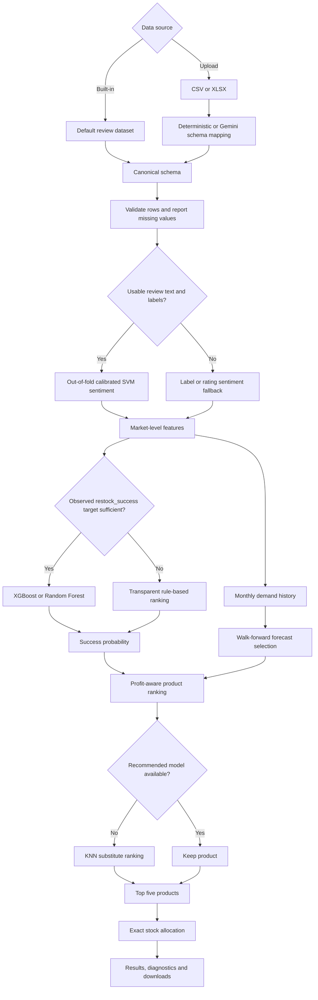

# Mobile Inventory Restocking Tool V2

A schema-adaptive inventory recommendation application combining explainable ranking, optional supervised product-success modeling, sentiment analysis, demand forecasting, profit-aware allocation and product substitution.

## Highlights

- Streamlit application for built-in and uploaded CSV/XLSX datasets
- Deterministic schema aliases with optional LangChain and Gemini assistance
- Row-level validation, missing-value reports and downloadable rejected rows
- MICE for correlated rating aggregates and median handling for other numeric predictors
- Transparent rule-based ranking when an external target is unavailable
- Optional XGBoost or Random Forest success modeling with an observed `restock_success` target
- Cross-validated comparison of MICE and native XGBoost missing-value handling
- Out-of-fold TF-IDF, lexicon and calibrated Linear SVM sentiment scores
- Walk-forward comparison of naive, exponential-smoothing, XGBoost and blended forecasts
- Purchase-cost-based profit estimates with documented fallbacks
- KNN substitute ranking using similarity, success probability and profit
- Exact largest-remainder unit allocation

## Workflow



## Architecture

```text
app.py
src/
  allocation.py
  forecasting.py
  missing_values.py
  model_selection.py
  pipeline.py
  schema.py
  sentiment.py
  substitution.py
notebooks/
  EDA_V2.ipynb
  eda_outputs/
tests/
  test_core.py
DATA_CARD.md
requirements.txt
requirements-dev.txt
pyproject.toml
ci.yml.example
Mobile Reviews Sentiment.csv
```

## Data modes

The application degrades gracefully according to the uploaded data:

| Mode | Available information | Behavior |
| --- | --- | --- |
| Full | Product, price, dates, demand and reviews | Ranking, sentiment and forecasting |
| Forecast | Product, price, dates and demand | Forecasting plus non-text ranking |
| Review | Product, price and review information | Sentiment-informed ranking |
| Recommendation | Product and selling price | Transparent rule-based ranking |
| Supervised | Any mode plus sufficient `restock_success` labels | XGBoost or Random Forest success probabilities |

The bundled review dataset does not contain an externally observed product-success target. It therefore uses transparent ranking instead of training a classifier to reproduce a proxy label.

## Required and optional fields

Required:

- `model`
- `price_inr` or `price_usd`

Optional:

- `review_id`
- `brand`
- `country`
- `age`
- `review_date`
- `review_text`
- `sentiment`
- Product rating fields
- `units_sold`
- `purchase_cost`
- `restock_success`

`restock_success` must be an externally observed binary outcome, such as whether a prior restocking decision met its defined business target. It is never created from the same model inputs.

Generic `cost` is intentionally not mapped automatically because it could mean selling price or purchase cost. Prefer explicit names such as `selling_price`, `retail_price`, `procurement_cost` or `wholesale_cost`, or confirm the mapping manually.

## Missing values in uploads

| Data type | Examples | Handling |
| --- | --- | --- |
| Required identifiers | `model` | Reject invalid rows |
| Required selling price | `price_inr`, `price_usd` | Recover INR from USD when possible; otherwise reject |
| Correlated numeric features | Product ratings | MICE inside training folds; preserve group missingness rates |
| Other numeric predictors | `age`, `purchase_cost` | Group median, global median and documented fallback |
| Categorical features | `brand`, `country` | `Unknown` or `Global`, followed by safe encoding |
| Review text | `review_text` | Empty string with sentiment fallback when text is insufficient |
| Regression target | `units_sold` | Never impute training targets |
| Success target | `restock_success` | Use only observed labels; otherwise use rule-based ranking |
| Missing monthly periods | Demand history | Zero for absent review activity; short internal interpolation for sales gaps |
| Forecast dates | `review_date` | Reject invalid forecasting rows |

Valid rows continue through the pipeline. Rejected rows include reasons and can be downloaded. The application also exports canonical valid rows.

## Product ranking

### Rule-based mode

When no reliable external target exists, the application reports a transparent ranking based on:

- 45% sentiment
- 35% average product ratings
- 20% normalized demand activity

This score is combined with normalized expected unit profit using a harmonic mean. Products with non-positive expected unit profit are excluded.

### Supervised mode

When enough observed `restock_success` examples from both classes are available, XGBoost or Random Forest is trained. The target is not included among model features. For XGBoost, MICE and native missing-value handling are compared using stratified cross-validation, and the selected approach is evaluated on a holdout set.

## Sentiment

When enough positive and negative labeled reviews are available, TF-IDF word and bigram features are combined with lexicon features and a calibrated Linear SVM. Out-of-fold probabilities are used for training records to prevent in-sample sentiment predictions from leaking into downstream modeling. A final model is fitted for new or unlabeled text.

If there is insufficient usable text, the pipeline falls back to an existing sentiment label or rating-derived score. Out-of-fold ROC-AUC and F1 are displayed when available.

## Demand forecasting

Monthly demand uses observed `units_sold` when available. Otherwise, review activity is clearly treated as a demand proxy. Missing target values are not imputed.

Walk-forward validation compares available methods:

- Naive last value
- Damped exponential smoothing
- XGBoost lag regression when at least 18 pre-validation observations exist
- A blended XGBoost and exponential-smoothing forecast

The method with the lowest validation MAE produces the final forecast. The selected method and MAE are shown in the stocking plan.

## Profit and substitution

Observed purchase cost is preferred. Missing costs fall back through brand and global medians before a documented margin assumption is used. Net unit profit subtracts expected return costs, and non-profitable candidates are excluded.

If a recommended product is unavailable, KNN compares standardized selling price and hardware-rating features. Replacement candidates are ranked with:

- 60% similarity
- 25% success probability
- 15% normalized profit

The output identifies the original product in `substitute_for` and reports substitution similarity.

## LangChain and Gemini

The optional mapper uses LangChain's `ChatGoogleGenerativeAI` integration and `gemini-flash-latest`. Only column names, inferred types and nullability are sent. Dataset rows are not sent. Deterministic mappings take priority over Gemini suggestions, and every mapping remains editable before processing.

```bash
export GOOGLE_API_KEY="your-key"
```

Free-tier access and rate limits depend on Google's current terms and region.

## Installation

Python 3.11–3.13 is supported.

```bash
python -m venv .venv
source .venv/bin/activate
pip install -r requirements-dev.txt
```

Run the application:

```bash
streamlit run app.py
```

Run tests:

```bash
pytest
python -m compileall -q app.py src tests
```

## Continuous integration

A workflow template is provided as `ci.yml.example`. Copy it to `.github/workflows/ci.yml` to enable automated compilation and tests on pushes and pull requests. The current GitHub integration did not have permission to create workflow files directly.

## Data governance

See `DATA_CARD.md` for intended use, limitations, privacy considerations and the missing source-license information that must be completed before production redistribution.

## Current limitations

- The bundled review dataset is demonstration data, not verified transaction history.
- Review counts are not equivalent to sales.
- Return costs and fallback margins remain heuristic.
- The application does not yet optimize against total procurement budget, lead time, current stock, MOQ or supplier capacity.
- The per-product XGBoost forecast remains experimental and is enabled only for sufficiently long histories.
- A deployed demonstration and persisted model registry are not included.
