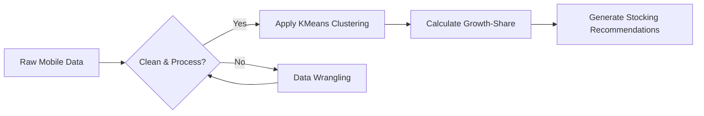
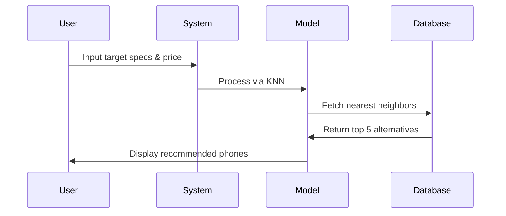

#  Mobile Inventory Restocking Tool

> A Machine Learning-powered recommender system utilizing KNN, KMeans, and Growth-Share Matrix to optimize inventory.
>


---

## ✨ Key Features

- **Smart Recommendations** based on customer reviews and sentiment
- **Clustering Algorithms** (KMeans) to segment the mobile market
- **Alternative Suggestions** using K-Nearest Neighbors (KNN)
- **Growth-Share Matrix** implementation for strategic inventory planning
- **Sentiment Analysis** 😄 👍 📱


---
 
## 🛠️ Tech Stack
 
- **Python 3.x**
- `pandas` — data loading and manipulation
- `numpy` — number crunching
- `scikit-learn` — machine learning models
- `matplotlib` + `seaborn` — graphs and charts
---

## 💻 Core Algorithm

```python
def recommend_alternative_phones(target_features, k=5):
    # Standardize the input features
    scaled_features = scaler.transform([target_features])
    
    # Use KNN to find the closest matches in our inventory
    distances, indices = knn_model.kneighbors(scaled_features, n_neighbors=k)
    
    recommended_phones = data.iloc[indices[0]]
    return recommended_phones[['Brand', 'Model', 'Price_INR', 'Specs_Score']]
```


##  System Architecture

### Recommendation Engine Flow



### User Interaction Sequence



---

##  Feature Comparison

| Feature | ML Restocking Tool (Ours) | Traditional Guesswork |
|---|---|---|
| Data-Driven Decisions | ✅ Sentiment & Specs | ❌ Gut Feeling |
| Alternative Suggestions | ✅ Automated via KNN | 🔄 Manual Search |
| Market Segmentation | ✅ KMeans Clustering | ❌ / Limited |
| Strategic Portfolio | ✅ Growth-Share Matrix | ❌ / Limited |

---

##  Project Status

- [x] Clean and preprocess sentiment data
- [x] Implement KMeans for market clustering
- [x] Build the KNN recommender engine
- [x] Apply Growth-Share matrix logic
- [ ] Deploy as an interactive web dashboard

---

##  Technical Notes

- The dataset handles missing values by either dropping them or **imputing** them using the *mean* or *median* values.
- For highlighting important predictions, look for the high-margin models or review the sentiment scores.
- Press `Shift` + `Enter` to run Jupyter Notebook cells.
- Algorithmic complexity: O(n²) for brute-force KNN, O(log n) for tree-based variants.

---

