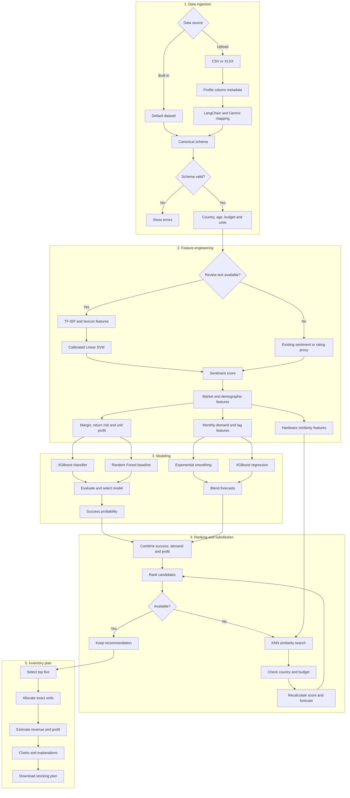

# Mobile Inventory Restocking Tool V2

A production-oriented machine learning application for demand forecasting, market scoring, sentiment-ready data ingestion and inventory allocation.

## What changed in V2

V2 replaces the notebook-only workflow with reusable Python modules and a Streamlit application. It keeps exponential smoothing, country and age analysis, profit-aware ranking, unavailable-product filtering and exact stock allocation.

The advanced stack includes:

- XGBoost classification for product-success scoring
- Random Forest as a comparison model
- XGBoost regression with lag features for demand forecasting
- Damped exponential smoothing retained as a statistical forecast
- A blended statistical and machine learning forecast
- TF-IDF and lexicon features with a calibrated linear SVM for sentiment analysis
- LangChain with Google Gemini for uploaded-dataset schema mapping
- Deterministic schema validation and type conversion
- Exact largest-remainder stock allocation
- Streamlit interface and downloadable recommendations

## V2 workflow



## Architecture

```text
app.py
src/
  allocation.py
  forecasting.py
  pipeline.py
  schema.py
  sentiment.py
notebooks/
  eda_v2.ipynb
tests/
  test_core.py
Mobile Reviews Sentiment.csv
```

## Data modes

- Full mode: product, price, date, demand or review records, and sentiment information
- Forecast mode: product, price, date, and demand or review records
- Review mode: product, price, and review text or sentiment
- Recommendation mode: product and price

Product and price are required. Optional ratings, age, brand and country receive safe defaults when absent.

## LangChain and Gemini schema mapping

The optional mapper uses LangChain's `ChatGoogleGenerativeAI` integration and the `gemini-flash-latest` model alias. It sends only column names, inferred types and nullability. Dataset rows are not sent. Gemini returns a structured mapping through a Pydantic schema, and Python validates it before applying approved renaming and type conversions. Generated code is not executed.

Create a Gemini API key in Google AI Studio and set it before starting the app:

```bash
export GOOGLE_API_KEY="your-key"
```

Gemini API free-tier availability and rate limits depend on Google's current terms and the selected region. Manual and deterministic mapping remain available without an API key.

## Canonical fields

Required:

- `model`
- `price_inr` or `price_usd`

Optional:

- `review_id`
- `brand`
- `country`
- `age`
- `review_date`
- `review_text`
- `sentiment`
- `rating`
- `battery_life_rating`
- `camera_rating`
- `performance_rating`
- `design_rating`
- `display_rating`
- `units_sold`
- `purchase_cost`

Alternate names such as `product`, `mobile_name`, `nation`, `sales` and `cost` can be mapped to this schema.

## Modeling approach

### Product-success model

Country and product records are aggregated into a market table. A proxy winner label is created from country-level sentiment and demand thresholds. XGBoost is the default classifier, with Random Forest available for comparison.

The built-in dataset contains review activity rather than verified transactions, so the target is a proxy. Production deployments should use an observed outcome such as target attainment, stock-out risk or profitable restocking.

### Demand forecast

Monthly demand uses `units_sold` when available. Otherwise, monthly review volume is used as a demand proxy. The forecast combines damped exponential smoothing with XGBoost regression using three lags and a rolling mean. Short histories fall back to exponential smoothing or the historical mean.

### Sentiment

The sentiment module combines word and bigram TF-IDF features with lexicon features for positive terms, negative terms, negations and intensifiers. A calibrated linear SVM produces class probabilities. A labeled `review_text` dataset is required to train it; the built-in dataset can continue using its existing sentiment column when text is unavailable.

### Inventory allocation

The final rank uses the harmonic mean of success probability and normalized estimated profit. Largest-remainder allocation guarantees that suggested quantities sum exactly to the requested units.

## Installation

```bash
python -m venv .venv
source .venv/bin/activate
pip install -r requirements.txt
```

On Windows:

```bash
.venv\Scripts\activate
pip install -r requirements.txt
```

## Run

```bash
streamlit run app.py
```

Choose the built-in dataset or upload a CSV/XLSX file, confirm the schema mapping, select the target market and generate a stocking plan.

## Tests

```bash
pytest -q
```

The tests cover exact allocation, zero-demand fallback, deterministic schema mapping, required-field validation and invalid types.

## Current assumptions

- Built-in review counts are demand proxies, not confirmed sales.
- USD prices use a fixed conversion rate of 87 INR per USD.
- Margins and return rates are heuristic until transaction-level data is provided.
- The winner label is based on relative sentiment and demand within each country.
- Gemini mapping is advisory and always followed by deterministic validation.

## Recommended production data

- Historical units sold
- Current inventory
- Purchase cost and selling price
- Supplier lead time
- Minimum order quantity
- Maximum supplier capacity
- Returns and lost sales
- Storage cost and procurement budget

These fields can support constrained profit optimization and stock-out risk prediction in a later release.
